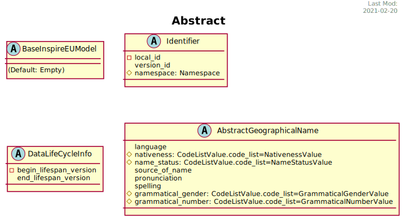

***************
Abstract Models
***************

They are data types or common definitions of fields that will be used in several django models when inherit them.

* BaseInspireEUModel: Default is an empty class
* DataLifeCycleInfo
* Identifier
* AbstractGeographicalName

.. automodule:: inspire_eu.models.core
   :members: BaseInspireEUModel,Identifier
   :member-order: bysource
   :inherited-members:
   :exclude-members: __init__,clean,clean_fields,full_clean,get_deferred_fields,refresh_from_db,save,save_base,serializable_value,validate_unique,DoesNotExist,MultipleObjectsReturned,Status,Theme,ApplicationSchema,CodeList,CodeListValue,UnitOfMeasure,Namespace

.. automodule:: inspire_eu.models.abstract
   :members: Identifier,DataLifeCycleInfo,AbstractGeographicalName
   :member-order: bysource
   :inherited-members:
   :exclude-members: __init__,clean,clean_fields,full_clean,get_deferred_fields,refresh_from_db,save,save_base,serializable_value,validate_unique,DoesNotExist,MultipleObjectsReturned
