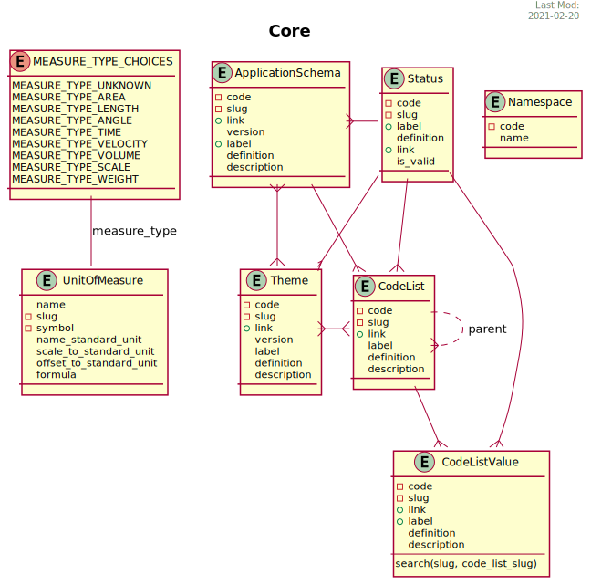

***********
Core Models
***********

They are the models that are needed to make sense of the application

.. automodule:: inspire_eu.models.core
   :members: Status,Theme,ApplicationSchema,CodeList,CodeListValue,UnitOfMeasure,Namespace
   :member-order: bysource
   :noindex:
   :inherited-members:
   :exclude-members: __init__,clean,clean_fields,full_clean,get_deferred_fields,refresh_from_db,save,save_base,serializable_value,validate_unique,DoesNotExist, MultipleObjectsReturned,BaseInspireEUModel
