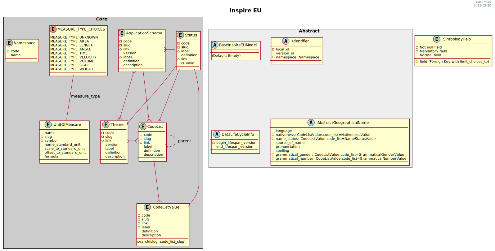

================
Developer Guide
================

The main philosophy of the package is to be able to reuse and / or extend all the models. To achieve this it
is important to know that all UML classes are defined as abstract models in django and for instanciating a
working model would must be as easy as inherit abstract models only.

**Basic concepts**

* :doc:`Abstract models <abstract>`
* :doc:`Core models <core>`

Customizating an existing theme
-------------------------------

Following the above philosophy you can easily create/customize an existing theme.

If you want extend some fields in a particular model:

.. table:: Differences between Original and Customizated
   :class: developer
   :align: center
   :widths: auto

   +-----------------------------------------------------------------+----------------------------------------------------------------+
   |                      Django Inspire EU                          |                     **My Awesome Project**                     |
   +-----------------------------------------------------------------+----------------------------------------------------------------+
   | .. code-block:: python                                          | .. code-block:: python                                         |
   |    :caption: ``inspire_eu.settings.py``                         |      :caption: ``my_awesome_proect.settings.py``               |
   |                                                                 |                                                                |
   |    INSPIRE_EU_THEMES = {                                        |       INSPIRE_EU_THEMES = {                                    |
   |        # ...                                                    |           # ...                                                |
   |        "cadastral_parcels": True,                               |           "cadastral_parcels": False,                          |
   |        "buildings": True,                                       |           "buildings": True,                                   |
   |        # ...                                                    |           # ...                                                |
   |    }                                                            |       }                                                        |
   |                                                                 |                                                                |
   +-----------------------------------------------------------------+----------------------------------------------------------------+
   | .. code-block:: python                                          | .. code-block:: python                                         |
   |    :caption: ``inspire_eu.cadastral_parcels.models.__init.py__``|     :caption: ``my_awesome_app.models.__init.py__``            |
   |                                                                 |                                                                |
   |    if INSPIRE_EU_THEMES.get("cadastral_parcels"):               |     from inspire_eu.models.abstract import (                   |
   |      from .abstract import AbstractCadastralZoning              |       AbstractCadastralZoning, AbstractCadastralParcel         |
   |      from .abstract import AbstractCadastralParcel              |     )                                                          |
   |                                                                 |     class AbstractCity(models.Model):                          |
   |                                                                 |       city = models.CharField(max_length=64)                   |
   |                                                                 |                                                                |
   |                                                                 |       class Meta:                                              |
   |                                                                 |         abstract = True                                        |
   |                                                                 |                                                                |
   |                                                                 |                                                                |
   |      class CadastralZoning(AbstractCadastralZoning,             |     class CadastralZoning(AbstractCadastralZoning,             |
   |                            models.Model)                        |                           AbstractCity,                        |
   |        pass                                                     |                           models.Model):                       |
   |                                                                 |       pass                                                     |
   |                                                                 |                                                                |
   |                                                                 |                                                                |
   |    class CadastralParcel(AbstractCadastralParcel,               |     class AnotherExample(AbstractCadastralParcel,              |
   |                          models.Model):                         |                          AbstractCity,                         |
   |      cadastral_zoning = models.ForeignKey(                      |                          models.Model):                        |
   |            CadastralZoning, on_delete=models.PROTECT,           |       country = models.CharField(max_length=64)                |
   |            blank=True, null=True                                |                                                                |
   |      )                                                          |                                                                |
   |                                                                 |                                                                |
   +-----------------------------------------------------------------+----------------------------------------------------------------+
   |                                                                 | **Result**:                                                    |
   |                                                                 |                                                                |
   |                                                                 | * ``CadastralZoning`` will add ``city`` field                  |
   |                                                                 | * ``AnotherExample`` will add ``city`` and ``country`` fields  |
   |                                                                 | * Also will be available all ``Building`` models               |
   |                                                                 |                                                                |
   +-----------------------------------------------------------------+----------------------------------------------------------------+

Creating a new theme
--------------------

.. hint::
   To program a new theme you can see how the previous ones are made, even start doing copy & paste

* Define all django models as abstract, in a new python module called ``abstract.py``
* Create a new entry in ``settings.INSPIRE_EU_THEMES`` with the default value ``True``
* In the ``__init__.py`` instantiate it -or not- depending on the value of the previous key
* Check it out the ``inspire_eu.admin.__init__.py`` and add the new ones.
